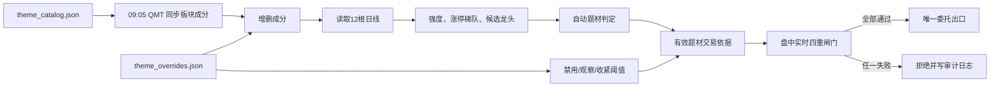

# QMT V5 自动题材维护与高质量打板策略

> **版本：V5.0.0｜默认模式：DRY RUN（绝不发送委托）**
>
> 这是迅投 QMT / miniQMT 的 A 股超短线打板策略升级包。它把“有题材、有共振、有龙头、有资金承接”的主观纪律固化为可审计的盘前数据流程和盘中硬闸门；**人工覆盖文件不能绕过硬风控**。

## QMT 直接载入：单文件版本

如果希望像常规 QMT 策略一样只载入一个 `.py` 文件，请使用仓库根目录的
`qmt_theme_board_v5_single_file.py`。它不依赖 `theme_engine.py` 或其他本地 Python
模块；首次运行时会在 `C:\qmt_theme_v5` 自动创建 `theme_catalog.json` 和
`theme_overrides.json`，并将盘前快照、有效题材依据和闸门审计日志写入该目录。

载入前仅需在文件 `init(C)` 内填写 `g.acct`，然后按本机 QMT 板块树修改首次生成的
`theme_catalog.json`。策略默认 `g.live_order_enabled = False`，因此可直接在模拟环境
观察运行日志而不会发送订单。

## 功能概览

| 模块 | V5 行为 | 目的 |
|---|---|---|
| 盘前成分同步 | 按 `theme_catalog.json` 中的 QMT 板块名调用 `C.get_stock_list_in_sector()`，合并多个概念板块并写出成分快照 | 每日自动更新题材成分，不依赖过期静态股票池 |
| 题材强度 | 计算涨停家数、上涨广度、平均涨幅、总成交额、最高连板和高阶梯数量，给出 0–100 强度分 | 识别有扩散、有持续性的主线 |
| 涨停梯队与龙头 | 以连续收盘涨停、日线收盘质量、动量、成交额计算候选龙头分 | 拒绝低位跟风和无辨识度个股 |
| 人工覆盖合并 | 同步结果 → 人工增删成分 → 自动扫描 → `theme_overrides.json` 禁用/观察/收紧阈值 → 有效交易依据 | 保留交易员判断，同时杜绝人为破坏纪律 |
| 盘中四重闸门 | 有效题材、板块共振、龙头资格、实时封单/买卖盘承接均需通过 | 防范孤立板、炸板与无资金承接的假强势 |
| 审计与复盘 | 写入题材成分、自动扫描、有效依据和逐笔 `jsonl` 闸门日志 | 任何“不买/买入意图”都可盘后追溯 |

## 策略结构

```text
qmt_theme_v5/
├── qmt_theme_board_v5.py     # QMT 策略入口；唯一可能调用 passorder 的文件
├── theme_engine.py           # 可单测的题材、梯队、覆盖和风控逻辑
├── config/
│   ├── theme_catalog.json    # 题材 → QMT 板块名称映射
│   └── theme_overrides.json  # 人工覆盖文件
├── tests/test_theme_engine.py
└── output/                   # 运行后自动生成（建议保留用于复盘）
```

## 每日交易依据生成流程



### 盘前时点与文件

策略在 **09:05** 自动同步一次，在 **09:24** 再次同步，以便让开盘前刚修改保存的覆盖文件生效。它会产生：

| 文件 | 内容 |
|---|---|
| `output/theme_membership_YYYYMMDD.json` | 各题材的板块同步结果、错误信息及有效成分股 |
| `output/theme_auto_YYYYMMDD.json` | 原始自动题材强度、涨停梯队、龙头候选与拒绝原因 |
| `output/effective_theme_basis_YYYYMMDD.json` | **唯一有效交易依据**；只有 `tradable_themes` 中题材才可进入盘中闸门 |
| `output/board_gate_audit_YYYYMMDD.jsonl` | 每次盘中闸门的通过/拒绝、资金指标和订单意图 |

如果 QMT 本地的板块命名不一致或接口无权限，成分同步的错误会被写入快照；此时没有通过完整扫描的题材不会交易。

## 强度、梯队、龙头规则

### 题材强度（0–100）

| 维度 | 最大分 | 解释 |
|---|---:|---|
| 涨停扩散 | 35 | 每只收盘涨停约 13 分，上限 35 |
| 梯队高度与完整度 | 25 | 最高连板高度 + 二板及以上数量 |
| 上涨广度 | 16 | 上涨成分占比；避免只靠一两只个股 |
| 平均涨幅 | 12 | 板块整体动量 |
| 成交额 | 8 | 板块流动性和资金参与 |
| 强势跟风扩散 | 4 | 非涨停但涨幅 ≥3% 的扩散 |

默认需要同时满足：**强度 ≥66、至少 2 只涨停、上涨广度 ≥52%、总成交额 ≥5 亿元、至少一名合格龙头**。任一失败，题材不会进入交易依据。

候选龙头由以下维度排序：连板高度（核心）、是否收盘涨停、当日动量、收盘位置和成交额。默认要求：**龙头分 ≥72、至少一板、单股成交额 ≥1.5 亿元**。

## `theme_overrides.json`：可做与不可做

### 支持的人工覆盖

```json
{
  "global": {
    "rules": {"max_active_themes": 2}
  },
  "themes": {
    "人工智能": {
      "action": "auto",
      "include_stocks": ["000001.SZ"],
      "exclude_stocks": ["000002.SZ"],
      "min_strength": 72,
      "notes": "仅保留真正的应用端主线"
    },
    "某题材": {
      "action": "disable",
      "notes": "出现监管/消息证伪，今日不参与"
    },
    "观察题材": {
      "action": "watch",
      "notes": "进入看盘列表，不会自动放行交易"
    }
  }
}
```

| 字段 | 作用 |
|---|---|
| `action: disable` | 无条件从有效交易题材中移除 |
| `action: watch` / `force_watch` | 仅保留观察记录，**绝不**强行放行交易 |
| `include_stocks` / `exclude_stocks` | 在自动同步成分基础上增删；新增股票仍须通过全部日线与实时风控 |
| `min_strength` | 为该题材设置更严格（或在硬底线以上的）强度门槛 |
| `global.rules` | 覆盖可调参数；关键参数仍受硬底线限制 |

**不可做：**覆盖文件不能使孤立板通过，不能将非龙头改为龙头，不能跳过封板/封单验证，不能取消资金承接检查，也不能突破关键硬底线（至少 2 家涨停、题材强度至少 55、龙头分至少 65 等）。

## 盘中高质量打板纪律

盘中只在 **09:31–10:45** 评估候选。任意一项失败即拒绝，且写入审计日志：

1. **题材有效性**：股票必须来自当日 `effective_theme_basis` 内 `trade_allowed=true` 的题材。
2. **板块共振**：盘前已验证至少两只涨停、上涨广度、成交额和梯队；不接受孤立板。
3. **龙头地位**：必须是题材预选龙头，满足连板高度、龙头分、流动性条件。
4. **封板与资金承接**：实时价格必须封住涨停或在严格容忍范围内；不能从日内高点明显回落；封单金额默认不少于 1,800 万元、五档买卖盘承接比不少于 1.35。
5. **反炸板条件**：开盘幅度须在 -1.5%～6.5%，日内振幅不得超过 12.5%，当日成交额至少 1.2 亿元；超时不追。
6. **仓位与订单约束**：默认最多 3 个持仓、日内最多 3 个新增订单；买前检查可用资金、最小交易单位和在途委托。

卖出端保留动态追踪止盈：浮盈 3% 激活，按峰值浮盈阶梯控制回撤；未激活时固定止损 -5%；**14:55 强制清仓，不隔夜**。

## Windows / QMT 部署步骤

1. 将整个 `qmt_theme_v5` 文件夹复制至 Windows，例如 `C:\qmt_theme_v5`。
2. 在 QMT 策略编辑器中载入 `C:\qmt_theme_v5\qmt_theme_board_v5.py`。确保 `theme_engine.py` 与入口文件位于同一目录。
3. 修改入口脚本的 `g.acct = "YOUR_QMT_ACCOUNT"`；不要把真实账号提交至 Git。
4. 根据本机 QMT 板块树，编辑 `config\theme_catalog.json` 内每个 `sectors` 名称。先在 QMT 中手工验证 `C.get_stock_list_in_sector("板块名")` 能返回成员。
5. 先保持 `g.live_order_enabled = False`，运行后检查 `output\effective_theme_basis_YYYYMMDD.json` 与 `board_gate_audit_YYYYMMDD.jsonl`。
6. 在模拟账户连续验证真实行情、委托状态、板块命名和日志后，才可人工将 `g.live_order_enabled` 改为 `True`。

## 本地逻辑测试

无需安装 `xtquant`；题材计算与风控已和 QMT 运行时解耦：

```bash
cd qmt_theme_v5
python -m unittest discover -s tests -v
```

## 重要风险提示

- **不存在稳赚不赔的策略。** 打板是高频博弈；熊市、缩量、退潮及监管扰动时，题材共振与封单都可能迅速失效。
- 单元测试验证的是逻辑分支，并不是收益证明。历史统计和任何回测都不能完整反映涨停成交概率、排队优先级、滑点、撤单、停牌和冲击成本。
- 强烈建议至少在 QMT 模拟账户运行 **1–3 个月**，核验板块接口、实时五档字段、订单状态和实际成交后，才考虑极小仓位实盘。
- 本策略默认禁止实盘下单。打开 `live_order_enabled` 是使用者独立、明确的交易决定；请自行评估适当性与损失承受能力。
